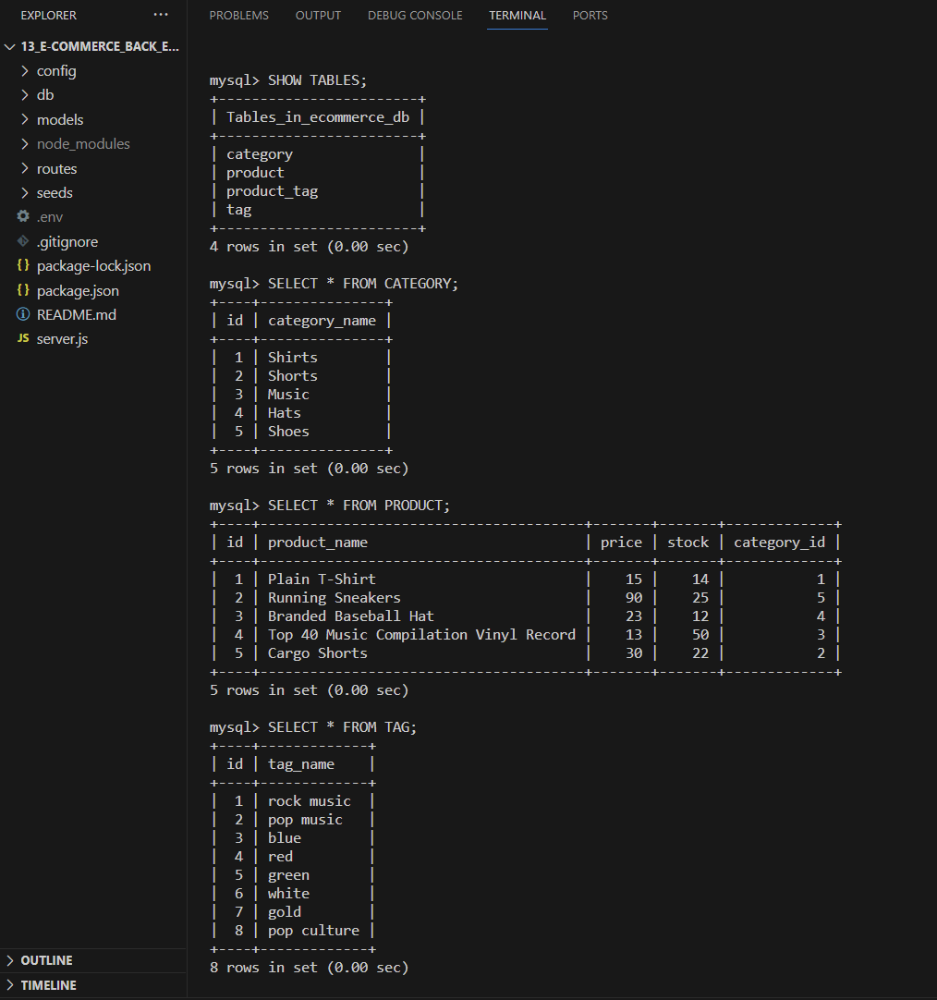

# E-Commerce Back End

## Description
A back end for an e-commerce site that uses Express.js API and Sequelize to interact with a MySQL database.

## Screenshot

## GitHub Link
https://github.com/FannyCandy/13_E-Commerce_Back_End

## Walkthrough video
https://drive.google.com/file/d/1BBrr_S_Kt8A-gvhX0IeUTFe9mY9_BYM1/view?usp=sharing

## Credit / Resources used
NU BootCamp curriculum